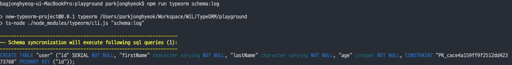
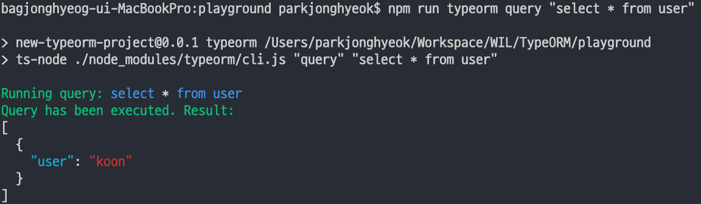

> 이 글은 프론트엔드 개발자가 백엔드에 깊은 지식없이 백엔드에 입문하는 과정을 다루고 있습니다. 정확하지 않는 내용이 있는 경우 시끄럽게 알려주시면 조용히 고치도록 하겠습니다.

### 👉 [TypeORM 공식문서](https://typeorm.io/#/)

## `ts-node` 설치하기

TypeORM CLI 는 자바스크립트로 만들어졌고 노드 환경에서 실행된다. 따라서, 타입스크립트를 이해할 수 없기 때문에 타입스크립트 코드를 자바스크립트 코드로 변환해줘야 한다. 이를 할 수 있는 모듈로 `ts-node` 가 있다. `ts-node` 를 전역으로 설치해주자.

```
$ npm i -g ts-node
```

설치가 완료되었다면, `package.json` 의 `script` 에 아래 명령을 추가해준다.

```
"scripts" {
    ...
    "typeorm": "ts-node ./node_modules/typeorm/cli.js"
}
```

스크립트 작성까지 완료되었다면, 스키마를 삭제하고 다시 생성하는 테스트를 해보자.

```
$ npm run typeorm schema:drop
```

**Database schema has been successfully dropped.** 가 출력되면 스키마가 모두 삭제되었다.

postgres 커맨드로 스키마가 모두 제거되었는지 확인해보자.

```
awesome_typeorm=> \dt
```

위 명령어를 입력하면 **Did not find any relations.** 메세지가 출력될 것이다.

이게 작성된 엔티티 기준으로 스키마를 다시 생성해보자.

```
$ npm run typeorm schema:sync
```

**Schema syncronization finished successfully.** 가 출력되면 정상적으로 스키마가 생성되었다.

그리고 postgres 커맨드로 `\dt` 명령어를 다시 입력하면 `user` 스키마가
생성된 것을 확인 할 수 있다.

## CLI 명령어

`drop` `sync` 이외에도 많은 명령어가 있다.

### 1. cli.js schema:sync

우리가 작성한 엔티티를 기준으로 데이터베이스 스키마를 동기화시킨다.

### 2. cli.js schema:log

`schema:sync` 커맨드로 동기화 시켜야하는 sql 을 보여준다. 예시로, `$ npm run typeorm schema:drop` 이후에 `$ npm run typeorm schema:log` 를 실행하면 아래와 같이 `user` 테이블을 동기화 시켜야한다고 나온다.



###3. cli.js schema:drop  
데이터 베이스의 테이블을 모두 지운다.

### 4. cli.js query [query]

입력한 쿼리를 실행한다. 예시로, `$ npm run typeorm query "select * from user"` 를 실행하면 아래와 같은 결과가 출력된다.



### 5. cli.js entity:create

새로운 `entity` 를 생성한다.

### 6. cli.js subscriber:create

새로운 `subscriber` 를 생성한다.

### 7. cli.js migration:create

새로운 `migration` 파일을 생성한다. 생성된 마이그레이션 파일은 비어있다.

### 7. cli.js migration:generate

새로운 마이그레이션 파일을 생성하고, 데이터베이스 업데이트가 필요한 sql 이 작성되어 있다.

### 8. cli.js migration:run

생성된 마이그레이션 파일을 실행한다.

### 9. cli.js migration:show

Show all migrations and whether they have been run or not

### 10. cli.js migration:revert

Reverts last executed migration.

### 11. cli.js version

Prints TypeORM version this project uses.

### 12. cli.js cache:clear

Clears all data stored in query runner cache.

### 13. cli.js init

Generates initial TypeORM project structure. If name specified then creates files inside directory called as name. If its not specified then creates files inside current directory.
