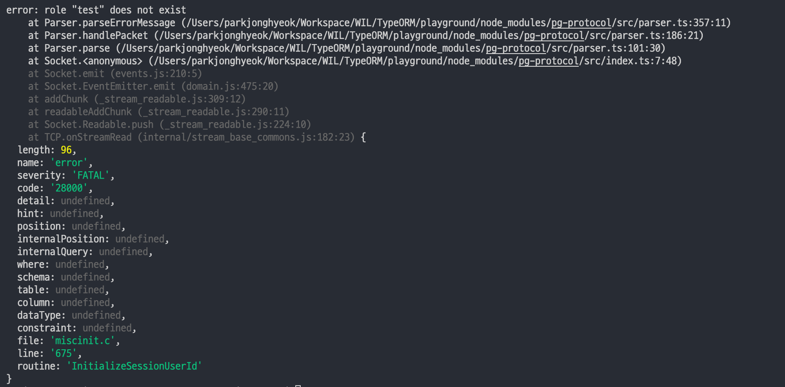
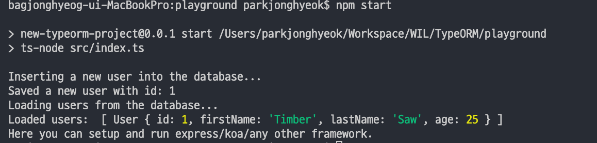

> 이 글은 프론트엔드 개발자가 백엔드에 깊은 지식없이 백엔드에 입문하는 과정을 다루고 있습니다. 정확하지 않는 내용이 있는 경우 시끄럽게 알려주시면 조용히 고치도록 하겠습니다.

### 👉 [TypeORM 공식문서](https://typeorm.io/#/)

## TypeORM 이란?

TypeORM 도 일종의 [ORM](https://en.wikipedia.org/wiki/Object%E2%80%93relational_mapping) (Object Relational Mapping) 이다.

## 왜 TypeORM 을 선택했나

express 로 관계형 데이터베이스를 다룰 때 자주 사용되는 sequelize 가 있다. 그럼에도 TypeORM 을 선택한 이유는 모델에 `class-validator` 를 조합해서 validation 처리하는 부분이 매력적으로 느껴졌다. 그리고 공식문서를 보기가 조금 더 편했고 TypeORM 을 선호하는 글이 많았다.

## TypeORM 설치

이제 본격적으로 TypeORM 을 설치하고 사용해보자.

우선 전역에 TypeORM을 설치해준다.

```
$ npm i -g typeorm
```

그리고 우리가 작업할 프로젝트로 이동해서 아래 명령어를 입력해주면 기본 TypeORM 프로젝트가 생성된다.

```
$ typeorm init --database postgres
```

우리는 데이터베이스를 postgres 를 사용할 예정이므로 `--database` 옵션에 postgres 를 넣어준다.

초기 세팅이 완료된 폴더 구조는 다음과 같다.

```
MyProject
├── src              // 여기서 서버 작업을 시작하면 된다.
│   ├── entity       // 엔티티 (데이터베이스 모델)을 작성한다.
│   │   └── User.ts  // 샘플 User 엔티티이다.
│   ├── migration    // 마이그레이션이 저장된다.
│   └── index.ts     // 어플리케이션의 엔트리 포인트이다.
├── .gitignore       // 우리가 잘 알고 있는 gitignore 파일이다.
├── ormconfig.json   // ORM 과 데이터베이스 연동을 다루고 있는 설정파일이다.
├── package.json     // 이것 또한 잘 알고 있는 package.json 파일이다.
├── README.md        // 샘플 README.md 이다.
└── tsconfig.json    // 타입스크립트 컴파일러 옵션이다.
```

들어가기 앞서, 어떤 패키지들이 설치되었는지 `package.json` 을 잠시 살펴 보자.

```json
{
    ...

    "devDependencies": {
        "ts-node": "3.3.0", // 타입스크립트를 실행하기 위한 패키지
        "@types/node": "^8.0.29",
        "typescript": "3.3.3333" // 타입스크립트
    },
    "dependencies": {
        "typeorm": "0.2.30", // typeorm
        "reflect-metadata": "^0.1.10", // 클래스에 @ (데코레이터)를 사용할 수 있게 해주는 패키지
        "pg": "^8.4.0" // pg 모듈
    },

   ...
}
```

> `typeorm init` 을 사용하지 않았다면 일일히 설치해줘야 할 것들이다.

이제 위 패키지들을 한 번에 설치하고 실행해보자.

```
$ npm i
$ npm start
```

그럼 처음부터 아래와 같은 에러를 볼 수 있을 것이다.



에러 메세지를 보면 `test` 라는 롤이 없다고 한다. 우리는 1편에서 설정한 롤과 데이터베이스를 `ormconfig.json` 에 적용해야 한다.

## ormconfig.json 세팅

```json
{
  "type": "postgres",
  "host": "localhost",
  "port": 5432,
  "username": "test", // 변경해야 하는 옵션
  "password": "test", // 변경해야 하는 옵션
  "database": "test", // 변경해야 하는 옵션
  "synchronize": true,
  "logging": false,
  "entities": ["src/entity/**/*.ts"],
  "migrations": ["src/migration/**/*.ts"],
  "subscribers": ["src/subscriber/**/*.ts"],
  "cli": {
    "entitiesDir": "src/entity",
    "migrationsDir": "src/migration",
    "subscribersDir": "src/subscriber"
  }
}
```

현재 주목해야 할 옵션은 아래와 같다. 너무 많은 것을 한번에 알려고 하면 머리만 아프다. TypeORM 이 조금 익숙해지고 다시 봐도 문제 없다.

- username: postgres 권한
- password: 권한 패스워드 (default root)
- database: database 이름
- synchronize: 동기화 여부
- logging: 로깅 여부

`synchronize` 을 조금더 설명한다면, `synchronize` 는 프로젝트가 실행될 때 마다 테이블 및 데이터를 계속해서 동기화 시켜준다. 개발 할 때 아주 편리한 옵션이다. 실제 배포할 땐 `synchronize` 옵션을 끄고 테이블을 마이그레이션 한다. 마이그레이션 처리에 대해서는 추 후에 알아보자.

이제 1장에서 설정한대로 변경하면 다음과 같다.

```json
...

  "username": "koon",
  "password": "root",
  "database": "awesome_typeorm",
...
```

그리고 실행 후 아래오 같은 결과를 봤다면 정상적으로 TypeORM 이 설정됐다.👏👏👏



다음 장에서는 express 를 TypeORM 프로젝트에 적용할 것이다.
